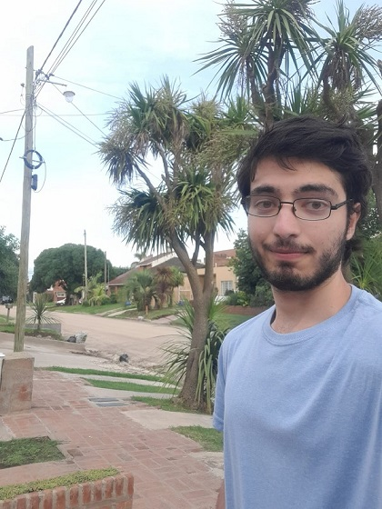
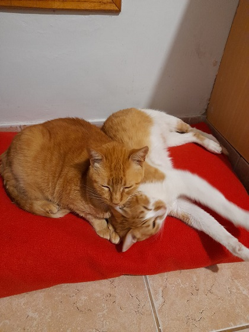

# Pablo Nicolás La Rocca

Legajo: 1762310

 

## Sobre mi
Tengo 22 años y estoy en segundo año de la carrera, también cursando algunas materias de otros años.

Soy una persona bastante curiosa y la vida me ha llevado hacia el mundo de la informática, especialmente la programación. Me egresé de un colegio técnico con la especialidad en programación, y luego me decidí por ingeniería en sistemas porque me gusta la idea de desarrollar sistemas completos integrando y aplicando los mismos a distintas áreas.

También tengo un interés en las investigaciones independientes, me gustaría vincular mis conocimientos para desarrollar cosas que puedan contribuir al bienestar de la humanidad y mejorar la calidad de vida de las personas.

Actualmente continuo aprendiendo sobre el stack MERN. Sin embargo, me atraen los lenguajes orientados a mejorar la optimización y la seguridad de los sistemas, de bajo/medio nivel como C o Rust. También me gusta programar C orientado a microcontroladores y aprender algo de electronica como hobby.

## Mis gustos
- Me gusta mucho el café y también los gatos (Mi foto une ambos xd)
- El flan es el mejor postre del mundo.
- Me gusta cocinar todo lo que sea panadería para la merienda o mi propio flan 😋
- Mi gusto preferido de helado es el super dulce de leche, pero si hay una moneda extra, elijo el gusto dulce de leche de cabra de rapanui ╰(*°▽°*)╯
- Cada tanto suelo jugar lolcito, en la cuenta main juego top/jg wukong y en otra cuenta only right click trynda top. Con amigos/compañeros juego cualquier línea. Otros juegos que cada tanto juego son CS GO o MTG Arena (juego de cartas).
- Me gusta pasear en lugares verdes, plazas, parques o la costanera.
- Suelo escuchar música de los 80s, Jazz, Soul & Funk, Groove, Rock, algo de Heavy metal, y electronica house de 1990-2007.
- Tengo 2 gatitos, una mamá llamada Sol y su hijo Benjamin (alias Benja o Benji)

 
